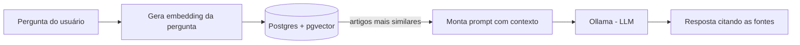

# CLT RAG Assistant

[](https://github.com/LuizArioza/clt-rag-assistant/actions/workflows/ci.yml)

Assistente de IA que responde perguntas sobre a CLT (Consolidação das Leis do Trabalho) em
linguagem natural, **citando o artigo exato** usado em cada resposta — construído do zero com
Spring Boot, PostgreSQL/pgvector e Ollama, usando o padrão RAG (Retrieval-Augmented Generation).

> Projeto de portfólio construído para aprender o ecossistema Spring na prática, indo do
> "Hello World" até um pipeline de IA funcional de ponta a ponta.

## Como funciona



1. **Ingestão** (uma vez): o texto de cada artigo da CLT é transformado num vetor numérico
   (embedding) e salvo no Postgres, usando a extensão `pgvector`.
2. **Busca**: quando alguém pergunta algo, a pergunta também vira um embedding, e o Postgres
   encontra os artigos com significado mais parecido (não é busca por palavra-chave).
3. **Geração**: os artigos encontrados viram o contexto de um prompt mandado pro Ollama (rodando
   localmente, sem custo de API), que gera a resposta final em português, citando as fontes.

## Stack

| Camada | Tecnologia |
|---|---|
| API | Spring Boot 3 (Java 21) |
| Banco de dados | PostgreSQL + [pgvector](https://github.com/pgvector/pgvector) |
| Migrations | Flyway |
| Embeddings | Ollama + `nomic-embed-text` |
| Geração de texto (LLM) | Ollama + `llama3.2` |
| Testes | JUnit 5 + Mockito |
| Frontend | React + Vite |
| Infraestrutura local | Docker Compose |
| CI | GitHub Actions |

## Endpoints

| Método | Rota | Descrição |
|---|---|---|
| GET | `/health` | Confirma que a aplicação está no ar |
| GET | `/db-health` | Confirma conexão com o Postgres e a extensão pgvector |
| GET | `/embedding-health` | Confirma conexão com o Ollama (embeddings) |
| POST | `/ingestao/executar` | Reprocessa os artigos da CLT e gera os embeddings |
| GET | `/perguntas?pergunta=...` | Busca os artigos mais relevantes pra uma pergunta (sem gerar texto) |
| GET | `/assistente?pergunta=...` | Endpoint principal: responde a pergunta citando as fontes |

## Como rodar localmente

Pré-requisitos: **Java 21**, **Maven**, **Docker** e (pra usar o frontend) **Node.js**.

```bash
# 1. Sobe o Postgres (com pgvector) e o Ollama
docker compose up -d

# 2. Baixa os modelos de IA no Ollama (só precisa fazer uma vez)
docker exec -it clt-rag-ollama ollama pull nomic-embed-text
docker exec -it clt-rag-ollama ollama pull llama3.2

# 3. Sobe a aplicação
mvn spring-boot:run

# 4. Popula o banco com os artigos da CLT (numa outra janela de terminal)
curl -X POST http://localhost:8080/ingestao/executar
```

Com tudo rodando, pergunte algo direto pela API:

```
http://localhost:8080/assistente?pergunta=quantas horas extras posso fazer por dia
```

```json
{
  "resposta": "De acordo com o artigo 59, você pode fazer até 2 horas extras por dia...",
  "fontes": ["Art. 59", "Art. 71", "Art. 58"]
}
```

## Frontend

Além da API, o projeto tem uma interface web em **React + Vite** (pasta `frontend/`)
que consome o endpoint `/assistente` — um campo de pergunta, loading e a resposta
exibida junto com os artigos usados como fonte.

```bash
cd frontend
npm install
npm run dev
```

Depois é só abrir `http://localhost:5173` no navegador (com o backend já rodando
em paralelo, passo anterior).

## Testes

```bash
mvn test
```

> **Nota:** os testes usam Mockito, que não funciona corretamente em versões muito recentes do
> JDK (descobrimos isso na prática, rodando em JDK 26). Rode os testes com **JDK 21** — o CI
> (`.github/workflows/ci.yml`) já está configurado assim. Localmente, se seu `JAVA_HOME` padrão
> for outra versão, aponte-o temporariamente pro JDK 21 só na janela do terminal antes de rodar
> `mvn test`.

## Sobre a base de dados da CLT

Este projeto usa um **conjunto curado de artigos** da CLT (jornada de trabalho, horas extras,
intervalo, férias, rescisão e justa causa) como amostra, não a legislação completa — o objetivo
foi validar o pipeline de ponta a ponta primeiro. O texto de cada artigo foi extraído de fontes
públicas oficiais. Expandir a base é só adicionar mais entradas em
`src/main/resources/data/clt-artigos.json`; o restante do pipeline não precisa mudar.

**Aviso:** este é um projeto de estudo/portfólio, não uma ferramenta de aconselhamento jurídico.

## Roadmap

- [ ] Expandir a base de artigos da CLT
- [ ] Busca híbrida (vetorial + texto)
- [x] Interface web simples
- [ ] Deploy público
- [ ] Avaliação automática da qualidade das respostas

## Arquitetura do código

```
src/main/java/com/luizarioza/cltrag/
├── api/          # health checks
├── assistente/    # orquestra busca + geração (o "RAG" propriamente dito)
├── busca/         # busca por similaridade vetorial no Postgres
├── config/        # configuração do Spring (CORS, etc.)
├── embedding/     # geração de embeddings via Ollama
├── erro/          # tratamento de erro centralizado
├── geracao/       # geração de texto via Ollama (LLM)
└── ingestao/      # pipeline de carga dos artigos da CLT

frontend/
├── index.html
└── src/
    ├── App.jsx    # interface do assistente (campo de pergunta + resposta)
    └── main.jsx   # ponto de entrada do React
```
